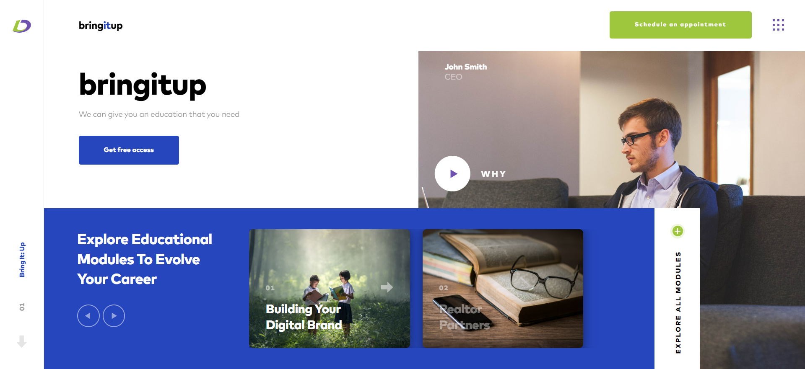
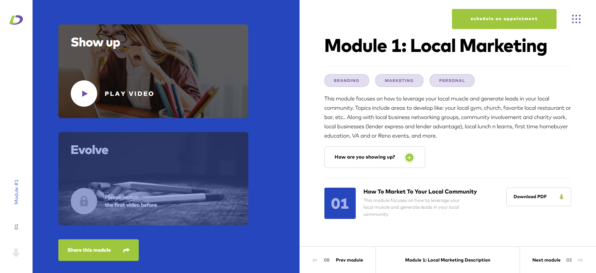

# BringItUp

### Техническое задание:

#### Общее:
1. Реализовать **слайдеры**:
    1. Главные слайдеры.
    2. Маленькие слайдеры.
    3. Маленький слайдер с автоматическим переключением (слайд 3).
2. Взаимодействие с **YouTube Player API** (для тех блоков, где указан `data-url` с `ID видео`).

#### Страница bringitup
1. Добавление **пунктов-карточек по нажатию кнопки** (слайд 2).
2. **Вспылвающее окно** (слайд 3).
3. **Формы отправки** с валидацией (слайд 4 и 6).

#### Страница Modules
1. **Аккордеон**: при клике на зелёную кнопку с крестиком появляется дополнительный текст.
2. Событие **скачивания файла** при клике по кнопке на странице.

### Дополнительная реализация (только для предпросмотра):
- **Код**: добавление класса `ChangePage`.
- **Страница bringitup**: при нажатии на кнопку `Get free access` осуществится переход на страницу с Модулями
- **Страница Modules**: при нажатии на кнопку `Share this module` осуществится переход на главную страницу.

### Предпросмотр
#### страница BringItUp

#### страница Module
